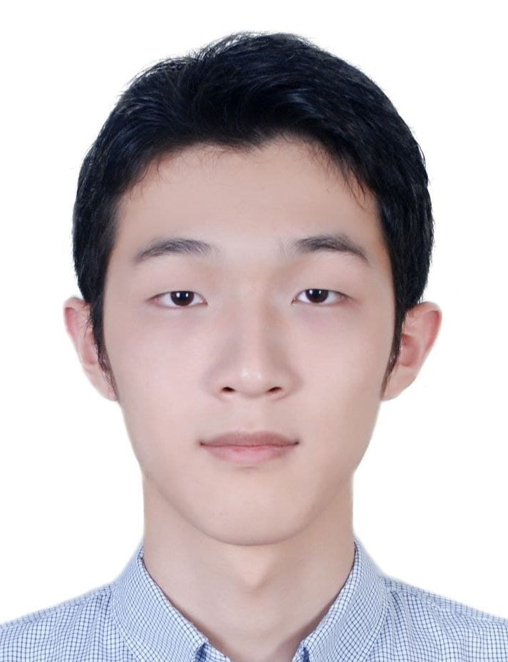



    

        

            
        

        

            
Yanchen Liu

            
📧 jamesnulliu@gmail.com

            
📞 (+86) 189-173-18020

            

                <a href="https://github.com/jamesnulliu" style="text-decoration: none;">🐙 GitHub: jamesnulliu</a>
            

            

                <a href="https://jamesnulliu.github.io" style="text-decoration: none;">😋 Personal Website</a>
            

            

                <a href="https://orcid.org/0009-0004-9352-2680" style="text-decoration: none;">🔬 ORCID</a>
            

        

    

## Education

### Shanghai University (SHU), *Shanghai, China* (2021.09 - 2025.06)

- B.Eng. in Computer Science and Technology, 2025 (expected)
- GPA: 3.65/4.0
- Advisor: Prof. Hang Yu
- Relevant Courses: Computer Vision, Computer Graphics, Data Mining, Computer Architecture, Compiler Principles, Probability and Statistics, Linear Algebra, etc.

<!-- ## Work experience -->
  

## Research Interests

- Computer Vision
- Machine Learning
- High Performance Computing
- Computer Architecture

## Achievements

- [2024.04] **First Prize** and **Group Competition Award** in [2024 ASC Student Supercomputer Challenge](http://www.asc-events.org/StudentChallenge/index.html#) Final Round.
- [2022.06] **First-Class Academic Scholarship** for outstanding academic performance, Shanghai University.

## Publications
1. Q. Liu, X. Li, K. Sun, Y. Li\* and **Y. Liu**\*, "SISSA: Real-Time Monitoring of Hardware Functional Safety and Cybersecurity With In-Vehicle SOME/IP Ethernet Traffic," in *IEEE Internet of Things Journal*, doi: 10.1109/JIOT.2024.3397665. [[Paper](https://ieeexplore.ieee.org/document/10521910)][[Code](https://github.com/jamesnulliu/SISSA)].
2. Li, Xingyu, Ruifeng Li, and **Yanchen Liu**. "HP-LSTM: Hawkes Process–LSTM-Based Detection of DDoS Attack for In-Vehicle Network." *Future Internet* 16.6 (2024): 185. [[Paper](https://www.mdpi.com/1999-5903/16/6/185)][[Code](https://github.com/jamesnulliu/HP-LSTM)]

## Projects

## Skills and Other Information
### Programming Abilities
- Programming Languages: **Python**, **C++**, **CUDA**, **Shell**
- Tools: **PyTorch**, **TensorFlow**, **OpenCV**, **CMake**, **Git**
- Operating Systems: **Linux**, **Windows**

### Languages
- English (fluent, CET-4: 625)
- Chinese (native)

### Open Source Contributions
- Principal maintainer of [Shanghai University Super Computing Team (SHUSCT)](https://github.com/SHUSCT).
- Contributor to [Shanghai University Open Source Community (SHUOSC)](https://github.com/shuosc).

### Hobbies
- 🎸 Electric Guitar
- 🎮 Anime, Comics and Games
- 📚 Reading

## Availability
Available for work **within a week**, open to internships **lasting more than 3 months**, available **five days a week**.